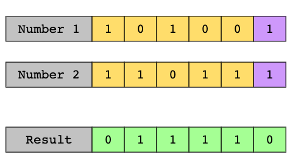
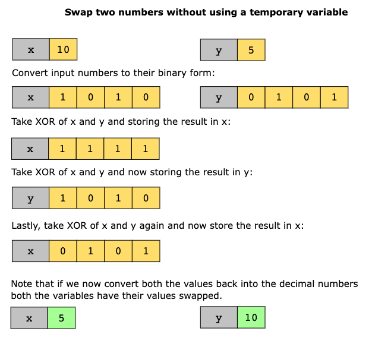
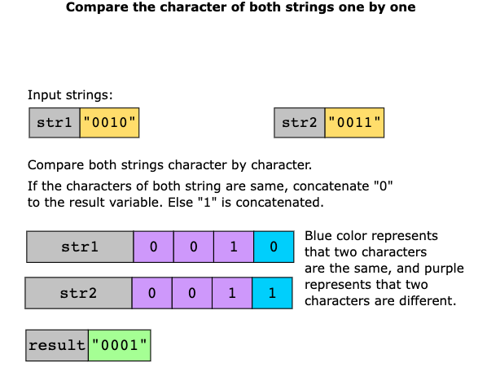

# Bitwise Manipulation Intro
**Bitwise Manipulation**: Modifying bits algorithmically with bitwise ops. Fast and efficient. They work on bit strings,
bit arrays, or binary numerals. They take bits as operands and calculate the corresponding bit value as the result.
## Operators

| **Operator** | **Function**                                           |
|--------------|--------------------------------------------------------|
| NOT ~        | Unary operator. If arg is 1, flip to 0 and vice versa. |
| AND &        | If both 1, return other. Otherwise return 0            |
| OR           | If either is 1, return 1. Otherwise return 0           |
| XOR ^        | If both are equal, return 0. Otherwise return 1        |

#### XOR Example:

### When to use?
* Yes if input data can be usefully manipulated at level of primitive bitwise logical operations.
* Yes if input data is unsorted, and solution seems to require sorting with better speed than `O(n log n)`
* Not when data is not in numeric form or can't be converted to numeric form.

### Use Cases:
* Bit field flags: To define things whose state is defined by a bool.
* Cryptography: To encrypt and decrypt sensitive data.
* Releasing Process Lock: If given an int list, can be used to represent the order which the lock was acquired and released in OS.

