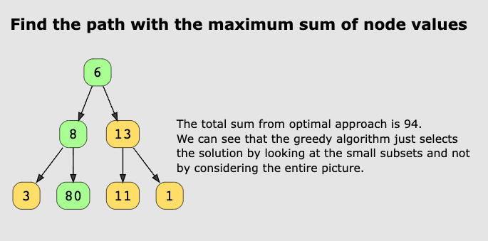
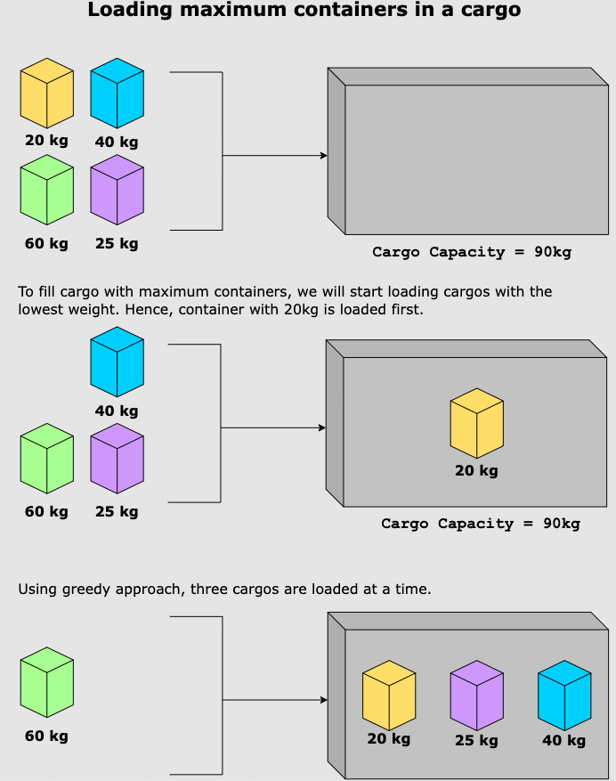
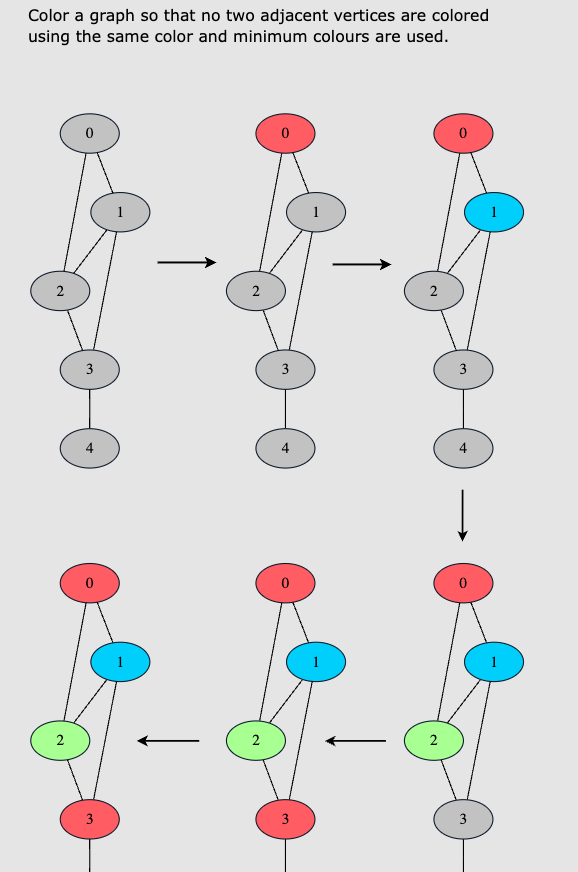

Greedy algorithms build solutions piece by piece, choosing what appears to be the most obvious immediate benefit next.

* Makes _locally optimized choices_, so only works for similar sub-problems, great for optimization problems.

Greedy algorithms don't guarantee an optimal solution, shown below.

But it can be useful for other problems:

#### When to use?
* When selecting a series of local optima allows constructing or identifying a globally optimal solution.
#### When to not use?
* When locally greedy choices can lead to sub-optimal solution
* Problem has no local optimum
* Not an optimization problem

### Real world examples
* CPU scheduling algorithms
* LAN Networks: finding a minimum spanning tree
* Social Network Sites: People recommendations via Dijkstra algo.
