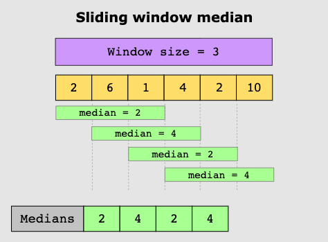
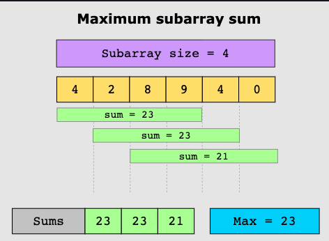

Sliding Window is a computational pattern used to reduce the use of nested loops. It's a variation
of the two pointers pattern, where pointers are used to set window bounds.

### Examples

### When to use this pattern:
If both conditions are met:
1. The problem required repeated computations on a contiguous set of data elements, so that
the window moves across the input array from one end to the other.
2. The computations performed each time the window moves take O91) time, or are a slow-growing
function, such as log, of a small variable.

### When to not use this pattern:
1. The input data structure doesn't support random access, OR:
2. All the data must be processed without segmentation.

### Use cases:
* Telecom: finding max number of users connected to a cell network's base station in every k-millisecond sliding window
* E-commerce: How many times a product occurs in a dataset of similar products viewed by a user
* Streaming: calculate median num of buffer events in a n minute interval for a user session.
* Social media content mining: Given list of topics that two users have posted about, find shorted sequence of posts by on
that includes topics the other user has posted about.